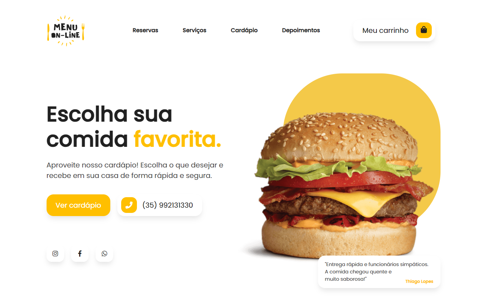

<h1 align="center">Cardápio Online no Whatsapp</h1>

Curso Front lee

  <a href="#-tecnologias">Tecnologias</a>&nbsp;&nbsp;&nbsp;|&nbsp;&nbsp;&nbsp;
  <a href="#-projeto">Projeto</a>&nbsp;&nbsp;&nbsp;|&nbsp;&nbsp;&nbsp;
  <a href="#memo-licença">Licença</a>

  

 

  

## 🚀 Tecnologias

Esse projeto foi desenvolvido com as seguintes tecnologias:

- HTML e CSS
- JavaScript
- Git e Github

## 💻 Projeto

Curso de Cardápio online no whatsapp.

## :memo: Licença

## Esse projeto está sob a licença MIT.

Feito com ♥ Eduardo Santos
